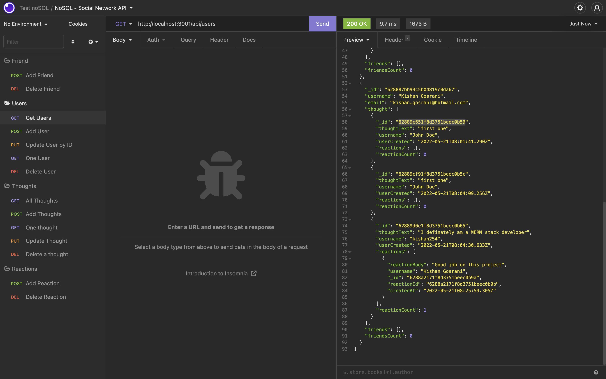
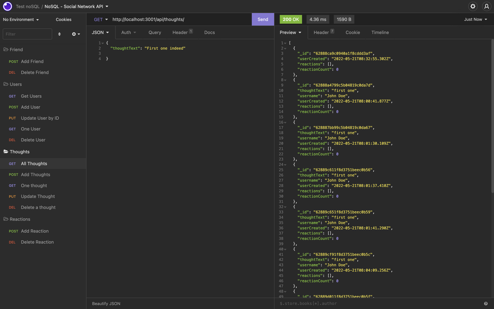
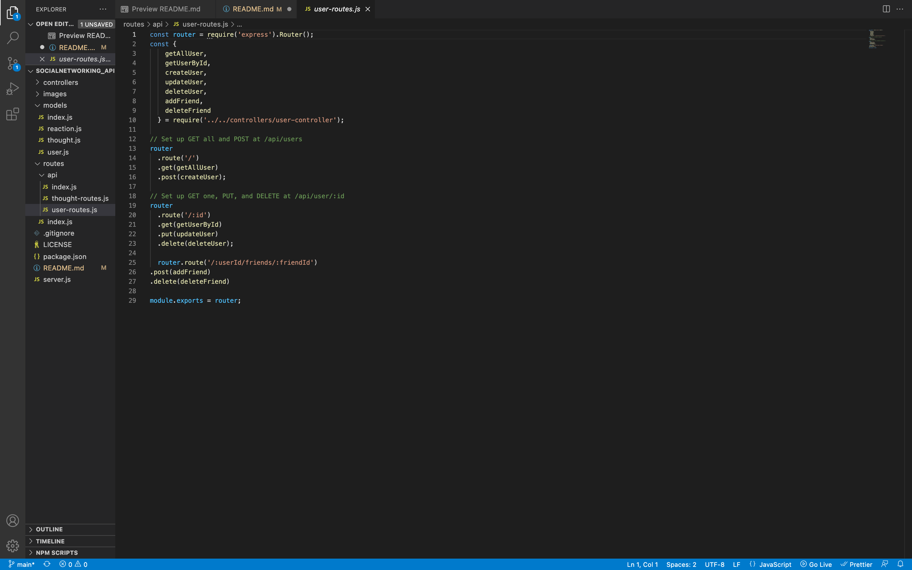
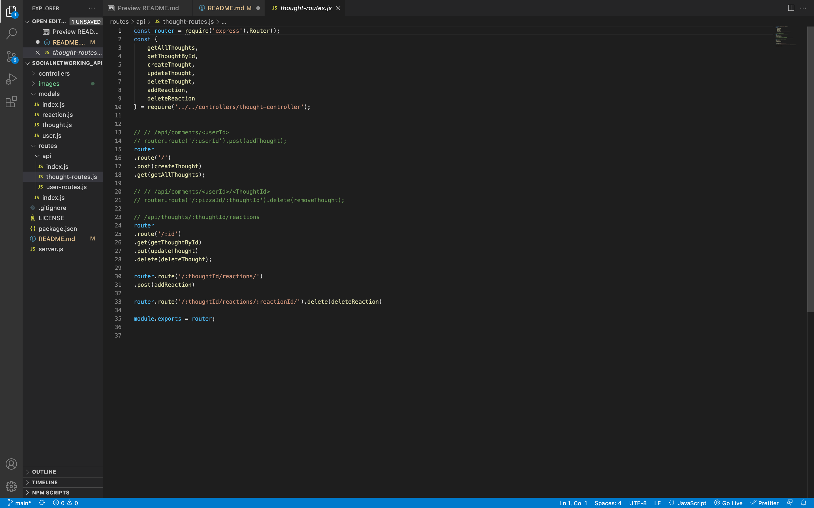
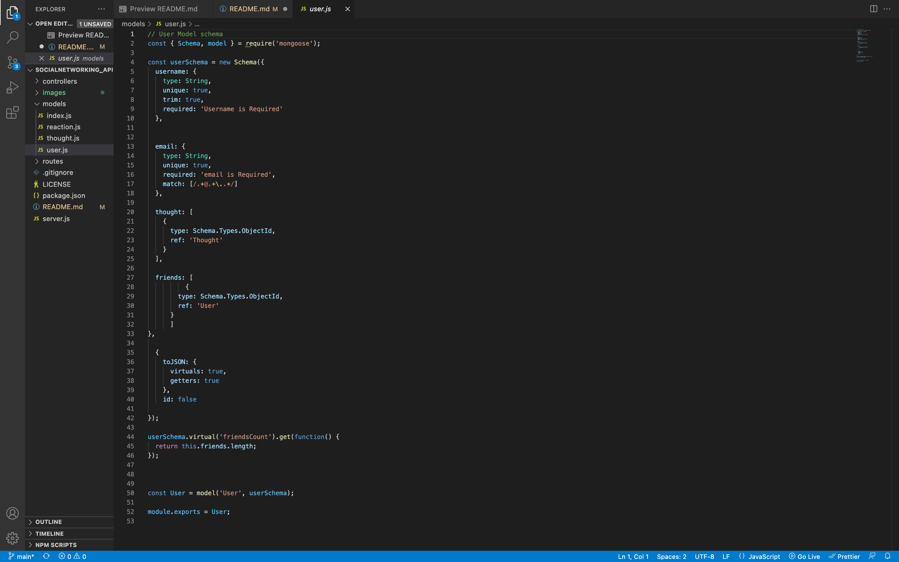
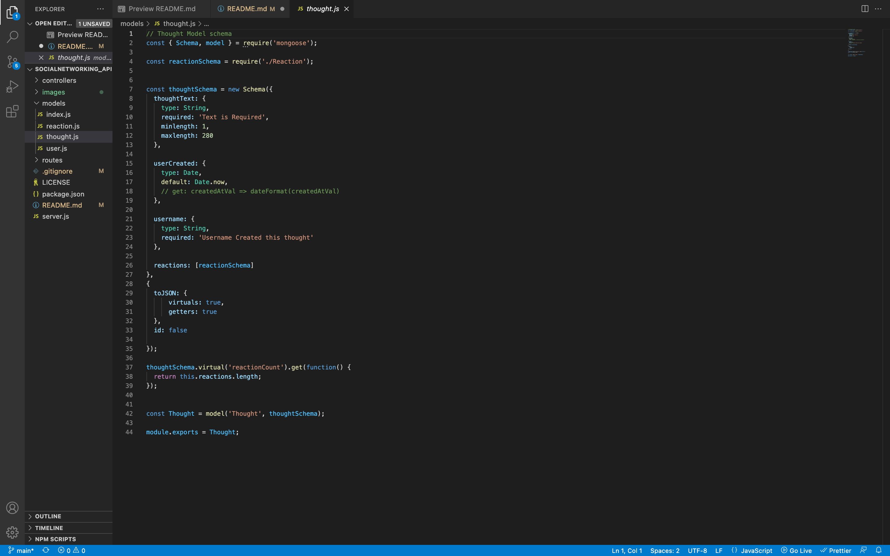
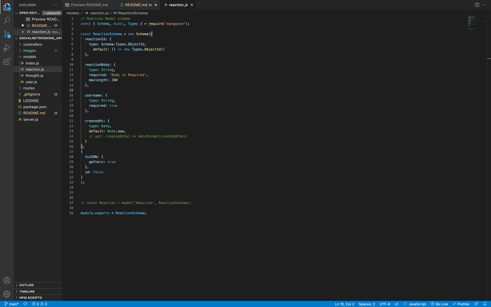

# socialNetworking_API
NoSQL, MongoDB

## Description

Social media API routes that uses CRUD principles for users, reacts and the thoughts

## Tabel of Contents

* [Installation](#installation)
* [Start](#Start)
* [Usage](#usage)
* [Contribute](#contribute)
* [Screenshots](#screenshots)
* [Technology](#technology)
* [Making](#making)
* [Questions](#questions)

## WALKTHOUGHT VIDEO

## Installation

In order to run this application, you will need to install the following

- git clone
- npm install

## Start

To run please use the following command after install:

- npm start

## Usage

In order to use this app, you will need to understand the following;

- API
- MongoDB
- Insonmia
- node.js
- Javascript
- NoSQL

## Contribute

In order to contribute to this app, you will need to understand the following;

- API
- MongoDB
- Insonmia
- node.js
- Javascript
- NoSQL

## Screenshots of deployed app

## Technology

- Github
- API
- MongoDB
- Insonmia
- node.js
- Javascript
- NoSQL

## Making

These are the screenshots of the code 

User Routes

Thought Routes

User Schema

Thought Schema

Reaction Schema

## Questions

Please click the links below

[Github] (https://github.com/kishan254)

Write me on;

[Email] (kishan.gosrani@hotmail.com)

## License

This project is currently licensed under the MIT [License](https://choosealicense.com/licenses/mit/)
